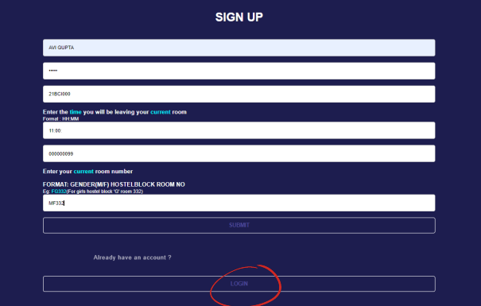
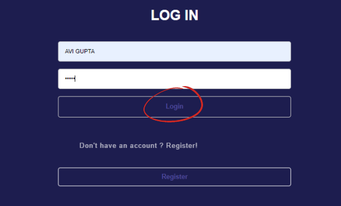
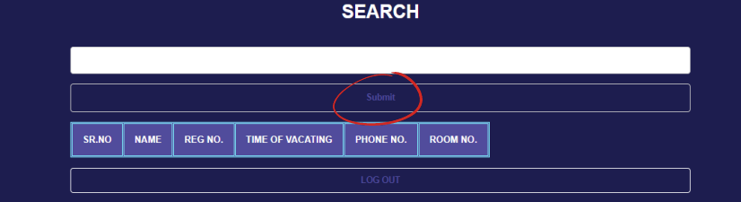
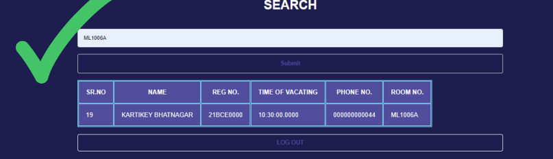

# ShiftBuddy

Welcome to Shift Buddy, your ultimate solution for all your hostel room shifting needs! Never again will you be confused about when to shift your room. With Shift Buddy, you can easily find out when the older occupants of your new room will be vacating it. Say goodbye to the stress of moving and hello to Shift Buddy!

## About Us

Are you tired of the hassle and uncertainty that comes with shifting to a new hostel room? Don't worry, we have got you covered! Shift Buddy provides instant access to all the information you need about when the older occupants of your new room will be vacating it.

## How it Works

### Step 1: Sign Up

Click on the "Sign Up" button to register.

### Step 2: Login

Enter your details in the sign-up page. If you already have an account, go to the LOGIN page by clicking on the LOGIN button.

### Step 3: Login and Search

After submitting your details, you will be directed to the login page. Enter your name and password, then click on the LOGIN button to be directed to the search bar to find the required room details.

### Step 4: Search for Room Details

Once logged in, you will be directed to the SEARCH bar. Enter the room number of the room you are moving into and click the SUBMIT button. You will receive details such as the time the room will be vacated and the contact details of the previous occupants.

### Step 5: Example

For example, if you are moving into room 1006A in L block, enter the room number accordingly to get the details as shown.

### Step 6: Logout
After getting the required details, click on the LOGOUT button to be directed back to the sign-up page of the website.

## Contributors
- [Avi Gupta](https://github.com/IVAVI17)
- [Kartikey Bhatnagar](https://github.com/kartikey-codes)

